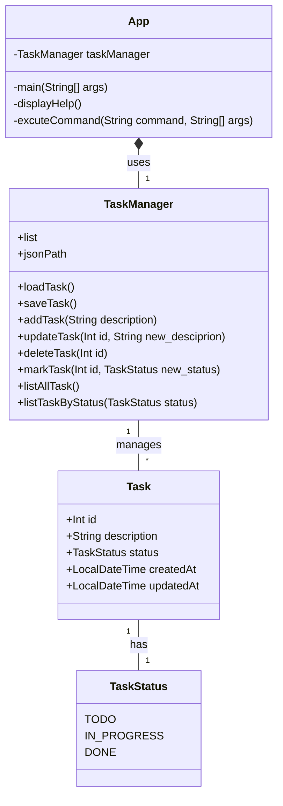

1. What is this project?
	- The project is to create a app command line interface to track and manage the tracks which user created.
	- User can manage their tracks by entering inputs via the command line.
2. Features
	- Create a new task.
	- Update a task.
	- Delete a task.
	- Mark the task ( done, in-progress, undone).
	- List all task.
	- List task based on done, undone, or in-progress.
	- See help information.
3. Constraints
	- Use Java programming language to build this project. --> Java
	- Use positional arguments in command line to accept inputs.
	- Use a JSON file to store the tasks in the current directory.
	- The JSON file should be created if it does not exist.
	- Can use any external libraries to build this project. --> com.google.gson
	- Ensure to handle errors and edges case gracefully.
4. Class Diagram 

